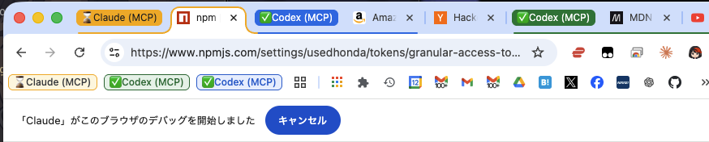

# codex-chrome-bridge

[](https://npmjs.org/package/codex-chrome-bridge)
[](LICENSE)
[](https://nodejs.org)

> Use Codex with the same Chrome path Claude in Chrome already uses — without patching Claude's side.

**The idea**: if Claude in Chrome already works on your machine, this wrapper lets Codex ride the same path.
No Puppeteer, no Playwright, no forked extension, no second browser instance — just reuse the browser connection that already exists.

**Zero modifications to Claude's side.** The Claude in Chrome extension, the native messaging host, and Claude Code itself are left untouched. This wrapper is a read-only consumer of the existing bridge: it discovers the live socket, speaks the same protocol, and rides along without patching your Claude setup.

**Why that matters operationally**: you keep your existing Chrome profile, existing logged-in sessions, and existing CiC setup. If this wrapper breaks, you fix or stop the wrapper repo — not your Claude installation. You also do **not** need to keep a Claude Code terminal session open while using the MCP; the existing local CiC/native-host runtime just needs to be present on the machine.



---

## How it works

```
                                    ┌──────────────────────────────────────────┐
                                    │         Untouched Claude infra           │
                                    │                                          │
Codex ──stdio──▶ codex-chrome-bridge (MCP) ──socket──▶ Claude native host ──▶ Chrome
                        │                                       │           (CiC extension)
                   22 MCP tools                         Existing bridge
                   (browser_*)                       (not modified in any way)
                                    │                                          │
                                    └──────────────────────────────────────────┘
```

1. **Claude in Chrome + the local Claude native-host runtime** establish the browser bridge that already exists on your machine
2. **This wrapper** discovers that bridge's live Unix socket via process inspection and connects as a second consumer
3. **Codex** sees 22 browser tools through a standard MCP interface
4. No patches, no forks, no extension modifications, no Claude-side config rewrites — just discovery and reuse

**Why this matters**: this project does not build a separate browser automation stack. It lets Codex coexist with your existing Claude-in-Chrome path while keeping blast radius low: the wrapper is the moving part, not your Claude setup.

---

## What makes this different

|                              | Typical browser MCP            | codex-chrome-bridge                   |
|------------------------------|--------------------------------|---------------------------------------|
| **Modifies Claude/extension**| N/A                            | No — zero changes to Claude's side    |
| **Needs Claude terminal open** | Varies                      | No — not during normal MCP use        |
| **Browser instance**         | Spawns its own                 | Reuses your existing Chrome           |
| **Extension required**       | Usually its own                | Claude in Chrome (already installed)  |
| **Login sessions**           | Separate (must re-login)       | Shares your existing sessions         |
| **Tab management**           | Independent                    | Uses CiC's managed tab groups         |
| **Rollback cost**            | Often medium                   | Low — stop the wrapper, Claude side stays as-is |
| **Permission model**         | Varies                         | CiC's permission choreography         |
| **Dependencies**             | Playwright / Puppeteer / etc.  | Zero (Node.js built-ins only)         |
| **Setup**                    | Install + configure + launch   | Discover + connect                    |

---

## Prerequisites

- **macOS** (native-messaging path is macOS-specific for now)
- **Node.js 24+**
- **Existing Claude in Chrome/native-host runtime** present on the machine
- **Claude in Chrome** extension active in Chrome
- Chrome running with at least one tab

---

## Quick Start

### 1. Install

```bash
npm install -g codex-chrome-bridge
```

Or run directly with npx:

```bash
npx codex-chrome-bridge probe
```

### 2. Check the bridge is reachable

```bash
codex-chrome-bridge probe
```

You should see `connect_ok: true` and `status_ok: true`.

This confirms that the existing CiC/native-host path is live. It does **not** require you to keep a Claude Code terminal session open.

### 3. Start the MCP server

```bash
codex-chrome-bridge mcp
```

The server listens on stdin/stdout using JSON-RPC 2.0 (MCP protocol).

### 4. Validate (optional)

```bash
npx codex-chrome-bridge validate     # prompt-safe, no popups
npx codex-chrome-bridge validate --live-browser  # full browser sweep
```

If you stop using the wrapper, your Claude side stays untouched: no extension patch to roll back, no forked host to uninstall, no browser profile rewrite to undo.

---

## MCP Tools (22)

<!-- TOOLS_START -->
| Tool | Required args | Description |
|------|---------------|-------------|
| `browser_health` | — | Check bridge connectivity and health |
| `browser_snapshot` | — | Return the current browser/tab context |
| `browser_tabs_context` | — | Return MCP tab-group context (optionally auto-create) |
| `browser_create_tab` | — | Create a new empty tab in the MCP tab group |
| `browser_navigate_tab` | `tabId`, `url` | Navigate a tab to a URL |
| `browser_open_or_focus` | — | Open a new tab for a URL |
| `browser_reuse_tab` | — | Confirm that an existing visible tab can be reused |
| `browser_close_tab` | `tabId` | Close a specific tab |
| `browser_javascript_exec` | `tabId`, `script` | Execute JavaScript |
| `browser_get_page_text` | `tabId` | Extract plain text |
| `browser_read_page` | `tabId` | Read an accessibility-tree style view of a tab or subtree |
| `browser_find` | `tabId`, `query` | Find an element using natural language |
| `browser_form_input` | `tabId`, `ref`, `value` | Set a form control value by ref |
| `browser_console_messages` | `tabId` | Read tracked browser console messages |
| `browser_network_requests` | `tabId` | Read tracked network requests |
| `browser_computer` | `tabId`, `action` | Unified action dispatch: hover, key, scroll, drag, right-click, double-click, wait, zoom, and scroll_to |
| `browser_click` | `tabId` | Click at viewport coordinates |
| `browser_type` | `tabId`, `text` | Type text into the focused element (optional click-first coordinates) |
| `browser_screenshot` | `tabId` | Capture a screenshot and cache the resulting image |
| `browser_upload_file` | `tabId`, `paths` | Upload local files to a file input |
| `browser_upload_image` | `tabId` | Upload an image from cache or local path to a target element |
| `browser_resize_window` | `tabId`, `width`, `height` | Resize the browser window |
<!-- TOOLS_END -->

### Categories

| Category        | Tools |
|-----------------|-------|
| **Discovery**   | `browser_health`, `browser_snapshot` |
| **Tabs**        | `browser_tabs_context`, `browser_create_tab`, `browser_navigate_tab`, `browser_open_or_focus`, `browser_reuse_tab`, `browser_close_tab` |
| **Interaction** | `browser_click`, `browser_type`, `browser_computer` |
| **Reading**     | `browser_read_page`, `browser_get_page_text`, `browser_find`, `browser_console_messages`, `browser_network_requests` |
| **Scripting**   | `browser_javascript_exec`, `browser_form_input` |
| **Media**       | `browser_screenshot`, `browser_upload_file`, `browser_upload_image`, `browser_resize_window` |

---

## Codex Integration

### Option A: Global install (recommended)

```bash
npm install -g codex-chrome-bridge
```

Add to `~/.codex/config.toml`:

```toml
[mcp_servers.codex_chrome_bridge]
command = "codex-chrome-bridge"
args = ["mcp"]
startup_timeout_sec = 20
```

### Option B: Project-local (npx)

```toml
# .codex/config.toml
[mcp_servers.codex_chrome_bridge]
command = "npx"
args = ["codex-chrome-bridge", "mcp"]
startup_timeout_sec = 20
```

### Option C: From source

```bash
git clone https://github.com/usedhonda/codex-chrome-bridge.git
cd codex-chrome-bridge
npm run codex:bridge
```

---

## Configuration

### Environment Variables

| Variable | Default | Description |
|----------|---------|-------------|
| `CLAUDE_BRIDGE_SOCKET_ROOT` | `/tmp/claude-mcp-browser-bridge-<user>` | Socket search directory |
| `CLAUDE_BRIDGE_MANIFEST_PATH` | (macOS default) | Native messaging manifest path |
| `CLAUDE_BRIDGE_LAUNCHER_PATH` | (auto-detected) | Claude Code binary path |
| `CLAUDE_BRIDGE_DISCOVERY_TIMEOUT_MS` | `5000` | Socket discovery timeout |
| `CLAUDE_BRIDGE_TOOL_TIMEOUT_MS` | `15000` | Per-tool execution timeout |
| `CLAUDE_BRIDGE_MCP_TRACE_PATH` | (disabled) | MCP JSON-RPC trace log path |

---

## Architecture

```
┌─────────────┐     stdio / JSON-RPC    ┌────────────────────────┐
│             │ ◀─────────────────────▶ │  codex-chrome-bridge   │
│   Codex     │                         │  (MCP server)          │
│             │                         │  src/bridge.js         │
└─────────────┘                         └───────────┬────────────┘
                                                    │ Unix socket
                                                    ▼
                                        ┌────────────────────────┐
                                        │  Claude native host    │
                                        │  (already running via  │
                                        │   Claude Code)         │
                                        └───────────┬────────────┘
                                                    │ Chrome native
                                                    │ messaging
                                                    ▼
                                        ┌────────────────────────┐
                                        │  Chrome browser        │
                                        │  + Claude in Chrome    │
                                        │    extension           │
                                        └────────────────────────┘
```

### Key design decisions

- **Zero dependencies** — only Node.js built-ins (`child_process`, `fs`, `net`, `os`, `path`, `crypto`)
- **Single file** — `src/bridge.js` (~2900 lines), no build step, no transpilation
- **Socket discovery** — finds the live native-host socket via `ps` process inspection
- **Session scoping** — each MCP session gets its own `sessionId` and `displayName`
- **Image caching** — screenshot LRU cache (max 24) for `browser_upload_image` reuse
- **Protocol negotiation** — supports MCP protocol versions `2025-06-18`, `2025-03-26`, `2024-11-05`

---

## Validation & Testing

```bash
npm test                # Hermetic unit tests (contract + fixtures + compat matrix)
npm run validate        # Prompt-safe live MCP validation (no popups)
npm run validate:live   # Full browser approval testing
npm run compat          # Drift detection against local environment
npm run release:gate    # Maintainer release checklist
```

---

## Known Limitations

### YELLOW verdict — usable but lifecycle-sensitive

This wrapper works well in practice, but the downstream contract is private:

- **Protocol drift** — Anthropic can change the CiC extension/native-host protocol at any time without notice
- **Permission popups** — CiC's permission choreography still applies (`ALWAYS`/`ONCE` grants, domain transitions)
- **Session coupling** — the bridge requires a running Claude native-host process
- **macOS only** — the native-messaging manifest path is macOS-specific for now

See [Known Limitations](./docs/known-limitations.md) and [Compatibility](./docs/compatibility.md) for details.

---

## Troubleshooting

| Problem | Likely cause | Fix |
|---------|-------------|-----|
| `probe` shows `connect_ok: false` | No Claude native host running | Start Claude Code or open a Claude in Chrome session |
| `probe` shows `socket not found` | Socket discovery failed | Check `CLAUDE_BRIDGE_SOCKET_ROOT` env var |
| Tools return timeout errors | CiC extension not responding | Refresh Chrome tab, check extension is enabled |
| Permission popup on every action | Grants are `ONCE`, not `ALWAYS` | Grant `ALWAYS` permissions per domain |
| `EPERM` or socket errors | Stale socket from previous session | Restart Claude Code to get a fresh socket |

See [Troubleshooting](./docs/troubleshooting.md) for more.

---

## Documentation

| Guide | Description |
|-------|-------------|
| [Quickstart](./docs/quickstart.md) | First-run setup and commands |
| [Compatibility](./docs/compatibility.md) | Version tracking and drift detection policy |
| [Known Limitations](./docs/known-limitations.md) | Power-user caveats |
| [Troubleshooting](./docs/troubleshooting.md) | Problem solving |
| [Version Matrix](./compat/version-matrix.json) | Validated extension/launcher baselines |

---

## License

[MIT](./LICENSE)
